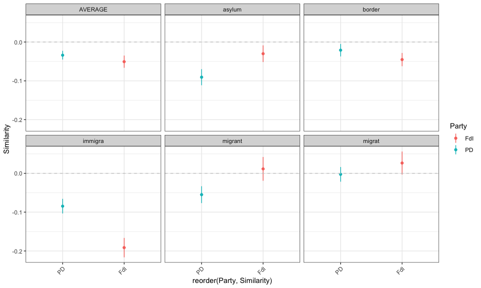

<!-- README.md is generated from README.Rmd. Please edit that file -->

# illibindex

<!-- badges: start -->

[](https://github.com/FraWagner/illibindex/actions)
[](https://lifecycle.r-lib.org/articles/stages.html#experimental)
<!-- badges: end -->

## Overview

**illibindex** measures liberal and illiberal rhetoric in political
discourse using word embeddings and cosine similarity. The package helps
researchers quantify how political actors position themselves on policy
issues by comparing their language to predefined liberal and illiberal
vocabularies.

### Key Features

- 📚 **Pre-built dictionaries** for immigration, gender, and other
  policy domains
- 🧠 **Word embedding training** using GloVe with bootstrap resampling
- 📊 **Cosine similarity analysis** to measure ideological positioning
- 🎯 **Flexible workflow** from text to validated measurements

## Installation

Install the development version from GitHub:

``` r
# install.packages("devtools")
devtools::install_github("FraWagner/illibindex")
```

## Quick Example

``` r
library(illibindex)

# Load the demo cosine similarity results
data(demo_cossim_IT)

# View the structure
head(demo_cossim_IT)
#> $immigration
#>              mean         sd       lowerci       upperci dimension      Policy
#> 1   -0.1054579454 0.09571988 -0.1242190412 -8.669685e-02   liberal immigration
#> 2    0.1152875003 0.05477303  0.1045519858  1.260230e-01 illiberal immigration
#> 3   -0.2207454457 0.10664822 -0.2416484959 -1.998424e-01  LibIllib immigration
#> 4    0.0182040805 0.10772008 -0.0031234067  3.953157e-02   liberal immigration
#> 5    0.0482716358 0.07549945  0.0333235069  6.321976e-02 illiberal immigration
#> 6   -0.0300675553 0.10857711 -0.0515647268 -8.570384e-03  LibIllib immigration
#> 7    0.0252719371 0.06535619  0.0124621242  3.808175e-02   liberal immigration
#> 8    0.0300475172 0.06789934  0.0167392470  4.335579e-02 illiberal immigration
#> 9   -0.0047755801 0.08468697 -0.0213742254  1.182307e-02  LibIllib immigration
#> 10   0.0292049220 0.13626176  0.0024976162  5.591223e-02   liberal immigration
#> 11   0.0597066919 0.07170116  0.0456532650  7.376012e-02 illiberal immigration
#> 12  -0.0305017699 0.14800339 -0.0595104339 -1.493106e-03  LibIllib immigration
#> 13  -0.0048034269 0.13974820 -0.0321940745  2.258722e-02   liberal immigration
#> 14  -0.0070128669 0.07115262 -0.0209587796  6.933046e-03 illiberal immigration
#> 15   0.0022094400 0.15695987 -0.0285546946  3.297357e-02  LibIllib immigration
#> 16  -0.0568834458 0.14899410 -0.0699695529 -4.379734e-02  LibIllib immigration
#> 17   0.0533465158 0.09970834  0.0338036812  7.288935e-02   liberal immigration
#> 18   0.1668864787 0.06272878  0.1545916375  1.791813e-01 illiberal immigration
#> 19  -0.1135399630 0.12901113 -0.1388261449 -8.825378e-02  LibIllib immigration
#> 20             NA         NA            NA            NA   liberal immigration
#> 21             NA         NA            NA            NA illiberal immigration
#> 22             NA         NA            NA            NA  LibIllib immigration
#> 23  -0.0135018692 0.06935042 -0.0270945509  9.081253e-05   liberal immigration
#> 24   0.0871272089 0.06472264  0.0744415708  9.981285e-02 illiberal immigration
#> 25  -0.1006290781 0.09120653 -0.1185055571 -8.275260e-02  LibIllib immigration
#> 26   0.1159991338 0.14285680  0.0877149301  1.442833e-01   liberal immigration
#> 27   0.0533462380 0.08920131  0.0356852788  7.100720e-02 illiberal immigration
#> 28   0.0626528958 0.16819424  0.0293521358  9.595366e-02  LibIllib immigration
#> 29   0.1136070030 0.14334127  0.0855121133  1.417019e-01   liberal immigration
#> 30   0.0457928011 0.08459631  0.0292119234  6.237368e-02 illiberal immigration
#> 31   0.0678142019 0.17001074  0.0344920962  1.011363e-01  LibIllib immigration
#> 32  -0.0213454777 0.16677251 -0.0377301969 -4.960759e-03  LibIllib immigration
#> 33  -0.0421204750 0.15200636 -0.0719137222 -1.232723e-02   liberal immigration
#> 34   0.2101553052 0.05829727  0.1987290407  2.215816e-01 illiberal immigration
#> 35  -0.2522757801 0.16584270 -0.2847809493 -2.197706e-01  LibIllib immigration
#> 36             NA         NA            NA            NA   liberal immigration
#> 37             NA         NA            NA            NA illiberal immigration
#> 38             NA         NA            NA            NA  LibIllib immigration
#> 39   0.0383713221 0.06674008  0.0252902665  5.145238e-02   liberal immigration
#> 40   0.1208847433 0.06258650  0.1086177888  1.331517e-01 illiberal immigration
#> 41  -0.0825134212 0.07669787 -0.0975462044 -6.748064e-02  LibIllib immigration
#> 42   0.0820905733 0.15374955  0.0518038475  1.123773e-01   liberal immigration
#> 43   0.0727486629 0.07155847  0.0586525446  8.684478e-02 illiberal immigration
#> 44   0.0093419104 0.16469937 -0.0231017916  4.178561e-02  LibIllib immigration
#> 45   0.0231288929 0.13785217 -0.0038901321  5.014792e-02   liberal immigration
#> 46   0.0321168535 0.07336196  0.0177379087  4.649580e-02 illiberal immigration
#> 47  -0.0089879606 0.15476671 -0.0393222363  2.134631e-02  LibIllib immigration
#> 48  -0.0838417721 0.17787150 -0.1012950090 -6.638854e-02  LibIllib immigration
#> 49  -0.0324954021 0.07786043 -0.0477560471 -1.723476e-02   liberal immigration
#> 50   0.2244685390 0.08437804  0.2079304437  2.410066e-01 illiberal immigration
#> 51  -0.2569639411 0.12396378 -0.2812608417 -2.326670e-01  LibIllib immigration
#> 52             NA         NA            NA            NA   liberal immigration
#> 53             NA         NA            NA            NA illiberal immigration
#> 54             NA         NA            NA            NA  LibIllib immigration
#> 55   0.0279366020 0.06288676  0.0156107975  4.026241e-02   liberal immigration
#> 56   0.0336378285 0.06855448  0.0202011502  4.707451e-02 illiberal immigration
#> 57  -0.0057012266 0.08894632 -0.0231347058  1.173225e-02  LibIllib immigration
#> 58   0.0640741888 0.10326355  0.0438345325  8.431385e-02   liberal immigration
#> 59   0.0248064567 0.08365011  0.0084110346  4.120188e-02 illiberal immigration
#> 60   0.0392677321 0.12377768  0.0150073072  6.352816e-02  LibIllib immigration
#> 61   0.0637186885 0.10637919  0.0428683678  8.456901e-02   liberal immigration
#> 62   0.0789181202 0.08848997  0.0615740856  9.626215e-02 illiberal immigration
#> 63  -0.0151994317 0.14305050 -0.0432373292  1.283847e-02  LibIllib immigration
#> 64  -0.0596492168 0.16759842 -0.0760738620 -4.322457e-02  LibIllib immigration
#> 65   0.0135578956 0.10460414 -0.0069445157  3.406031e-02   liberal immigration
#> 66   0.1270018718 0.07384211  0.1125288179  1.414749e-01 illiberal immigration
#> 67  -0.1134439762 0.11157332 -0.1353123464 -9.157561e-02  LibIllib immigration
#> 68             NA         NA            NA            NA   liberal immigration
#> 69             NA         NA            NA            NA illiberal immigration
#> 70             NA         NA            NA            NA  LibIllib immigration
#> 71  -0.0240360420 0.06813834 -0.0373911566 -1.068093e-02   liberal immigration
#> 72   0.0085088265 0.07140182 -0.0054859306  2.250358e-02 illiberal immigration
#> 73  -0.0325448685 0.09310023 -0.0507925146 -1.429722e-02  LibIllib immigration
#> 74   0.0818749174 0.14030795  0.0543745587  1.093753e-01   liberal immigration
#> 75   0.0300044142 0.07408823  0.0154831209  4.452571e-02 illiberal immigration
#> 76   0.0518705033 0.14868556  0.0227281337  8.101287e-02  LibIllib immigration
#> 77             NA         NA            NA            NA   liberal immigration
#> 78             NA         NA            NA            NA illiberal immigration
#> 79             NA         NA            NA            NA  LibIllib immigration
#> 80  -0.0313727805 0.13741269 -0.0469224898 -1.582307e-02  LibIllib immigration
#> 81  -0.0087595784 0.06385955 -0.0212760494  3.756893e-03   liberal immigration
#> 82   0.1968502869 0.08194878  0.1807883251  2.129122e-01 illiberal immigration
#> 83  -0.2056098653 0.09827739 -0.2248722332 -1.863475e-01  LibIllib immigration
#> 84   0.0418176091 0.08462237  0.0252316251  5.840359e-02   liberal immigration
#> 85   0.0796015080 0.07019845  0.0658426113  9.336040e-02 illiberal immigration
#> 86  -0.0377838989 0.10778726 -0.0589102028 -1.665760e-02  LibIllib immigration
#> 87   0.0002177075 0.06833307 -0.0131755736  1.361099e-02   liberal immigration
#> 88   0.0898655244 0.05928932  0.0782448183  1.014862e-01 illiberal immigration
#> 89  -0.0896478169 0.07887807 -0.1051079184 -7.418772e-02  LibIllib immigration
#> 90   0.0687156383 0.06588141  0.0558028824  8.162839e-02   liberal immigration
#> 91   0.0771173251 0.08097642  0.0612459463  9.298870e-02 illiberal immigration
#> 92  -0.0084016868 0.10367061 -0.0287211272  1.191775e-02  LibIllib immigration
#> 93  -0.0044895350 0.07826954 -0.0198303639  1.085129e-02   liberal immigration
#> 94   0.0432321429 0.11235704  0.0212101630  6.525412e-02 illiberal immigration
#> 95  -0.0477216778 0.11580762 -0.0704199714 -2.502338e-02  LibIllib immigration
#> 96  -0.0778329892 0.12254692 -0.0885747005 -6.709128e-02  LibIllib immigration
#> 97   0.0229451804 0.05989462  0.0112058343  3.468453e-02   liberal immigration
#> 98   0.1858852289 0.06997092  0.1721709277  1.995995e-01 illiberal immigration
#> 99  -0.1629400485 0.09225871 -0.1810227561 -1.448573e-01  LibIllib immigration
#> 100 -0.0012237505 0.06916727 -0.0147805363  1.233304e-02   liberal immigration
#> 101  0.0965410452 0.08270035  0.0803317761  1.127503e-01 illiberal immigration
#> 102 -0.0977647957 0.10009947 -0.1173842917 -7.814530e-02  LibIllib immigration
#> 103  0.0657513186 0.05722740  0.0545347491  7.696789e-02   liberal immigration
#> 104  0.0942372774 0.05278019  0.0838923598  1.045822e-01 illiberal immigration
#> 105 -0.0284859588 0.07317049 -0.0428273740 -1.414454e-02  LibIllib immigration
#> 106  0.0440771541 0.06844663  0.0306616153  5.749269e-02   liberal immigration
#> 107  0.0777165900 0.06802545  0.0643836022  9.104958e-02 illiberal immigration
#> 108 -0.0336394359 0.09197874 -0.0516672685 -1.561160e-02  LibIllib immigration
#> 109 -0.0068468503 0.07121971 -0.0208059128  7.112212e-03   liberal immigration
#> 110  0.0662161070 0.08103594  0.0503330631  8.209915e-02 illiberal immigration
#> 111 -0.0730629574 0.11486186 -0.0955758829 -5.055003e-02  LibIllib immigration
#> 112 -0.0791786393 0.10699562 -0.0885572185 -6.980006e-02  LibIllib immigration
#> 113  0.0776419622 0.05500375  0.0668612279  8.842270e-02   liberal immigration
#> 114  0.0905128726 0.08122719  0.0745923429  1.064334e-01 illiberal immigration
#> 115 -0.0128709104 0.09047843 -0.0306046828  4.862862e-03  LibIllib immigration
#> 116 -0.0029628541 0.07032283 -0.0169576483  1.103194e-02   liberal immigration
#> 117  0.1333077316 0.08142823  0.1171028744  1.495126e-01 illiberal immigration
#> 118 -0.1362705857 0.10768479 -0.1577007045 -1.148405e-01  LibIllib immigration
#> 119  0.0392797338 0.05525711  0.0284493399  5.011013e-02   liberal immigration
#> 120  0.0474974259 0.05841498  0.0360480908  5.894676e-02 illiberal immigration
#> 121 -0.0082176921 0.08152837 -0.0241972530  7.761869e-03  LibIllib immigration
#> 122  0.0421595834 0.06712967  0.0290021672  5.531700e-02   liberal immigration
#> 123 -0.0232934673 0.06894507 -0.0368067007 -9.780234e-03 illiberal immigration
#> 124  0.0654530507 0.08281942  0.0492204438  8.168566e-02  LibIllib immigration
#> 125  0.0148611758 0.07299545  0.0005540670  2.916828e-02   liberal immigration
#> 126  0.0588739592 0.08426179  0.0423586478  7.538927e-02 illiberal immigration
#> 127 -0.0440127834 0.10220807 -0.0640455653 -2.398000e-02  LibIllib immigration
#> 128 -0.0265253125 0.11352108 -0.0365058610 -1.654476e-02  LibIllib immigration
#> 129  0.0718395896 0.06861050  0.0583919308  8.528725e-02   liberal immigration
#> 130  0.0287582966 0.08455311  0.0121858880  4.533071e-02 illiberal immigration
#> 131  0.0430812930 0.10330393  0.0228337229  6.332886e-02  LibIllib immigration
#> 132            NA         NA            NA            NA   liberal immigration
#> 133            NA         NA            NA            NA illiberal immigration
#> 134            NA         NA            NA            NA  LibIllib immigration
#> 135  0.0125065934 0.06171643  0.0004101737  2.460301e-02   liberal immigration
#> 136  0.0405731207 0.07084893  0.0266867314  5.445951e-02 illiberal immigration
#> 137 -0.0280665273 0.08338549 -0.0444100830 -1.172297e-02  LibIllib immigration
#> 138  0.0707089122 0.07125701  0.0567425387  8.467529e-02   liberal immigration
#> 139  0.0844587671 0.08538816  0.0677226879  1.011948e-01 illiberal immigration
#> 140 -0.0137498549 0.09991089 -0.0333323886  5.832679e-03  LibIllib immigration
#> 141            NA         NA            NA            NA   liberal immigration
#> 142            NA         NA            NA            NA illiberal immigration
#> 143            NA         NA            NA            NA  LibIllib immigration
#> 144  0.0004216369 0.10043918 -0.0109441268  1.178740e-02  LibIllib immigration
#> 145            NA         NA            NA            NA   liberal immigration
#> 146            NA         NA            NA            NA illiberal immigration
#> 147            NA         NA            NA            NA  LibIllib immigration
#> 148            NA         NA            NA            NA   liberal immigration
#> 149            NA         NA            NA            NA illiberal immigration
#> 150            NA         NA            NA            NA  LibIllib immigration
#> 151  0.0050672234 0.06006511 -0.0067055391  1.683999e-02   liberal immigration
#> 152 -0.0443913009 0.06882779 -0.0578815480 -3.090105e-02 illiberal immigration
#> 153  0.0494585243 0.09443846  0.0309485864  6.796846e-02  LibIllib immigration
#> 154  0.0717019073 0.07550051  0.0568292577  8.657456e-02   liberal immigration
#> 155  0.0946242154 0.06956175  0.0809214271  1.083270e-01 illiberal immigration
#> 156 -0.0229223081 0.10377754 -0.0433651774 -2.479439e-03  LibIllib immigration
#> 157            NA         NA            NA            NA   liberal immigration
#> 158            NA         NA            NA            NA illiberal immigration
#> 159            NA         NA            NA            NA  LibIllib immigration
#> 160  0.0134499695 0.10538565 -0.0011923883  2.809233e-02  LibIllib immigration
#>     Party Time    word
#> 1     FdI 2018 immigra
#> 2     FdI 2018 immigra
#> 3     FdI 2018 immigra
#> 4     FdI 2018  asylum
#> 5     FdI 2018  asylum
#> 6     FdI 2018  asylum
#> 7     FdI 2018  border
#> 8     FdI 2018  border
#> 9     FdI 2018  border
#> 10    FdI 2018  migrat
#> 11    FdI 2018  migrat
#> 12    FdI 2018  migrat
#> 13    FdI 2018 migrant
#> 14    FdI 2018 migrant
#> 15    FdI 2018 migrant
#> 16    FdI 2018 AVERAGE
#> 17    FdI 2019 immigra
#> 18    FdI 2019 immigra
#> 19    FdI 2019 immigra
#> 20    FdI 2019  asylum
#> 21    FdI 2019  asylum
#> 22    FdI 2019  asylum
#> 23    FdI 2019  border
#> 24    FdI 2019  border
#> 25    FdI 2019  border
#> 26    FdI 2019  migrat
#> 27    FdI 2019  migrat
#> 28    FdI 2019  migrat
#> 29    FdI 2019 migrant
#> 30    FdI 2019 migrant
#> 31    FdI 2019 migrant
#> 32    FdI 2019 AVERAGE
#> 33    FdI 2020 immigra
#> 34    FdI 2020 immigra
#> 35    FdI 2020 immigra
#> 36    FdI 2020  asylum
#> 37    FdI 2020  asylum
#> 38    FdI 2020  asylum
#> 39    FdI 2020  border
#> 40    FdI 2020  border
#> 41    FdI 2020  border
#> 42    FdI 2020  migrat
#> 43    FdI 2020  migrat
#> 44    FdI 2020  migrat
#> 45    FdI 2020 migrant
#> 46    FdI 2020 migrant
#> 47    FdI 2020 migrant
#> 48    FdI 2020 AVERAGE
#> 49    FdI 2021 immigra
#> 50    FdI 2021 immigra
#> 51    FdI 2021 immigra
#> 52    FdI 2021  asylum
#> 53    FdI 2021  asylum
#> 54    FdI 2021  asylum
#> 55    FdI 2021  border
#> 56    FdI 2021  border
#> 57    FdI 2021  border
#> 58    FdI 2021  migrat
#> 59    FdI 2021  migrat
#> 60    FdI 2021  migrat
#> 61    FdI 2021 migrant
#> 62    FdI 2021 migrant
#> 63    FdI 2021 migrant
#> 64    FdI 2021 AVERAGE
#> 65    FdI 2022 immigra
#> 66    FdI 2022 immigra
#> 67    FdI 2022 immigra
#> 68    FdI 2022  asylum
#> 69    FdI 2022  asylum
#> 70    FdI 2022  asylum
#> 71    FdI 2022  border
#> 72    FdI 2022  border
#> 73    FdI 2022  border
#> 74    FdI 2022  migrat
#> 75    FdI 2022  migrat
#> 76    FdI 2022  migrat
#> 77    FdI 2022 migrant
#> 78    FdI 2022 migrant
#> 79    FdI 2022 migrant
#> 80    FdI 2022 AVERAGE
#> 81     PD 2018 immigra
#> 82     PD 2018 immigra
#> 83     PD 2018 immigra
#> 84     PD 2018  asylum
#> 85     PD 2018  asylum
#> 86     PD 2018  asylum
#> 87     PD 2018  border
#> 88     PD 2018  border
#> 89     PD 2018  border
#> 90     PD 2018  migrat
#> 91     PD 2018  migrat
#> 92     PD 2018  migrat
#> 93     PD 2018 migrant
#> 94     PD 2018 migrant
#> 95     PD 2018 migrant
#> 96     PD 2018 AVERAGE
#> 97     PD 2019 immigra
#> 98     PD 2019 immigra
#> 99     PD 2019 immigra
#> 100    PD 2019  asylum
#> 101    PD 2019  asylum
#> 102    PD 2019  asylum
#> 103    PD 2019  border
#> 104    PD 2019  border
#> 105    PD 2019  border
#> 106    PD 2019  migrat
#> 107    PD 2019  migrat
#> 108    PD 2019  migrat
#> 109    PD 2019 migrant
#> 110    PD 2019 migrant
#> 111    PD 2019 migrant
#> 112    PD 2019 AVERAGE
#> 113    PD 2020 immigra
#> 114    PD 2020 immigra
#> 115    PD 2020 immigra
#> 116    PD 2020  asylum
#> 117    PD 2020  asylum
#> 118    PD 2020  asylum
#> 119    PD 2020  border
#> 120    PD 2020  border
#> 121    PD 2020  border
#> 122    PD 2020  migrat
#> 123    PD 2020  migrat
#> 124    PD 2020  migrat
#> 125    PD 2020 migrant
#> 126    PD 2020 migrant
#> 127    PD 2020 migrant
#> 128    PD 2020 AVERAGE
#> 129    PD 2021 immigra
#> 130    PD 2021 immigra
#> 131    PD 2021 immigra
#> 132    PD 2021  asylum
#> 133    PD 2021  asylum
#> 134    PD 2021  asylum
#> 135    PD 2021  border
#> 136    PD 2021  border
#> 137    PD 2021  border
#> 138    PD 2021  migrat
#> 139    PD 2021  migrat
#> 140    PD 2021  migrat
#> 141    PD 2021 migrant
#> 142    PD 2021 migrant
#> 143    PD 2021 migrant
#> 144    PD 2021 AVERAGE
#> 145    PD 2022 immigra
#> 146    PD 2022 immigra
#> 147    PD 2022 immigra
#> 148    PD 2022  asylum
#> 149    PD 2022  asylum
#> 150    PD 2022  asylum
#> 151    PD 2022  border
#> 152    PD 2022  border
#> 153    PD 2022  border
#> 154    PD 2022  migrat
#> 155    PD 2022  migrat
#> 156    PD 2022  migrat
#> 157    PD 2022 migrant
#> 158    PD 2022 migrant
#> 159    PD 2022 migrant
#> 160    PD 2022 AVERAGE
```

## Working with Dictionaries

The package includes pre-built dictionaries for analyzing political
rhetoric:

``` r
library(illibindex)

# Load built-in dictionaries
data(dictionaries)

# See available policy domains
names(dictionaries)
#> [1] "immigration"

# View immigration-related terms
dictionaries$immigration$term
#> [1] "immigra" "asylum"  "border"  "migrat"  "migrant" NA        NA

head(dictionaries$liberal$immigra)
#> NULL
```

## Visualizing Results

Using the demo data, we can visualize how political parties position
themselves:

``` r
library(illibindex)

# Load demo results
data(demo_cossim_IT)

# Use the built-in plotting function
plot_libVillib_wordfacet()
#> No results files found. Using demo_cossim_IT.
```



## Understanding the Scores

**Liberal-Illiberal (LibIllib) Score:** - Calculated as:
`liberal_similarity - illiberal_similarity` - **Positive values**:
Actor’s language closer to liberal vocabulary - **Negative values**:
Actor’s language closer to illiberal vocabulary - **Near zero**: Neutral
or ambiguous positioning

**Individual Dimensions:** - `liberal`: Mean cosine similarity to
liberal terms - `illiberal`: Mean cosine similarity to illiberal terms -
`LibIllib`: The difference score (main measure of interest)

## Full Workflow

### Step 1: Prepare Your Data

``` r
# Load your corpus (example using included data)
data(corpus_ITA)
head(corpus_ITA)
```

### Step 2: Train Word Embeddings

``` r
# Train embeddings with bootstrap resampling
train_word_embeddings(
  country = "Italy",
  model = "model1",
  output_dir = "output/embeddings",
  corpus = corpus_ITA,
  n_bootstrap = 100,
  window_size = 6,
  dim = 300
)
```

### Step 3: Calculate Cosine Similarity

``` r
# Calculate similarity scores
results <- calc_cosSim(
  country = "Italy",
  model = "model1",
  which = "immigration",
  embeddings_path = "output/embeddings/Italy/model1",
  save = TRUE,
  output_dir = "output/results"
)

# View results
head(results$immigration)
```

## Advanced Usage

### Custom Dictionaries

You can create your own dictionaries following the package format:

``` r
# Create a custom dictionary data frame
custom_dict <- data.frame(
  country = "all",
  term = NA,
  climate_liberal = c("renewable", "sustainable", "green", NA),
  climate_illiberal = c("hoax", "expensive", "unnecessary", NA),
  stringsAsFactors = FALSE
)

# Add to dictionaries list
data(dictionaries)
dictionaries$climate <- custom_dict

# Process it
climate_dict <- process_dictionary(dictionaries, "climate")
```

## Data Included

The package includes example datasets:

- **`dictionaries`**: Liberal and illiberal term lists for multiple
  policy domains
- **`corpus_ITA`**: Italian political party corpus for demonstration
- **`demo_cossim_IT`**: Pre-computed cosine similarity results

``` r
# See what data is available
data(package = "illibindex")
```

## Citation

If you use this package in your research, please cite:

    Wagner, F. (2024). illibindex: Measuring Liberal and Illiberal Rhetoric 
    in Political Discourse. R package version 0.1.0. 
    https://github.com/FraWagner/illibindex

## Related Work

This package implements methods for measuring ideological positioning
using word embeddings. For theoretical background and validation, see:

- [“Measuring Illiberalism: Mapping Illiberalism in Seven Countries,
  2000-2022.”](https://preprints.apsanet.org/engage/apsa/article-details/67840ffc6dde43c9083af8cb)
- [“Opposition to Government and Back: How Illiberal Parties Shape
  Immigration Discourse and Party
  Competition”](https://www.cogitatiopress.com/politicsandgovernance/article/view/9609)

## Contributing

Contributions are welcome! Please feel free to:

- Report bugs or request features via [GitHub
  Issues](https://github.com/FraWagner/illibindex/issues)
- Submit pull requests
- Suggest new dictionaries or policy domains

## License

GPL-3

------------------------------------------------------------------------
